# Webbaserat bokföringssystem med AI

**Bokföring.AI** är ett webbaserat bokföringsprogram utvecklat under flera kurser i min utbildning.  
Det är designat för koncernredovisning och hanterar flera bolag i samma system.

Backend: FastApi, SQLAlchemy

Databas: PostgreSQL

Frontend: React

Projektet integrerar tre AI-flöden för att automatisera ekonomiska processer:

✅ **Extrahering av fakturainformation från leverantörsfakturor**  
→ OCR och LLM tolkar PDF-fakturor och sparar data strukturerat i databasen.

✅ **Automatisk kontering av fakturarader**  
→ AI och vektordatabas föreslår konton baserat på tidigare bokföring.

✅ **AI-agent för frågor och verktygsanrop**  
→ Chatbaserad hjälp som kan svara på frågor eller anropa specifika verktyg via Orchestrator-agenter.

Nedan finns några bilder som visar olika delar av systemet. Klicka på dem för att förstora!

<h2>Bilder från projektet</h2>

  <a href="images/start.png" target="_blank">
    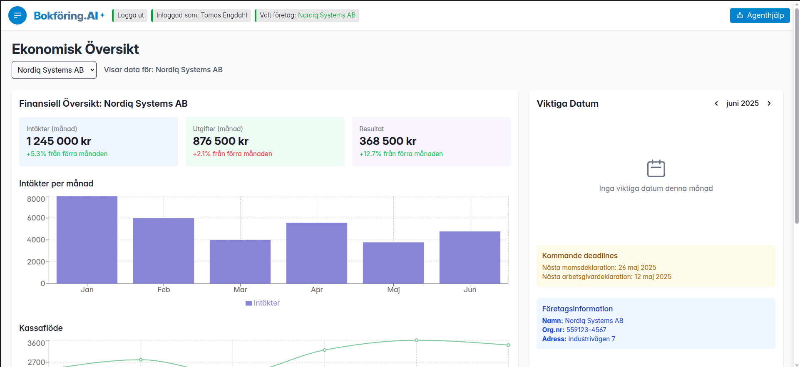
  </a>

<h4>Manuell bokföring</h4>

  <a href="images/manuall_journal_entry.png" target="_blank">
    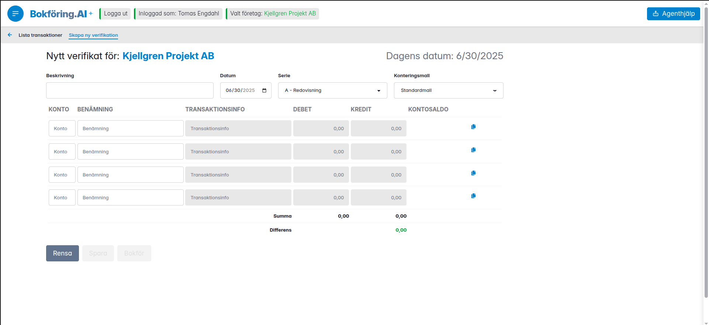
  </a>
  <a href="images/list_transaktions.png" target="_blank">
    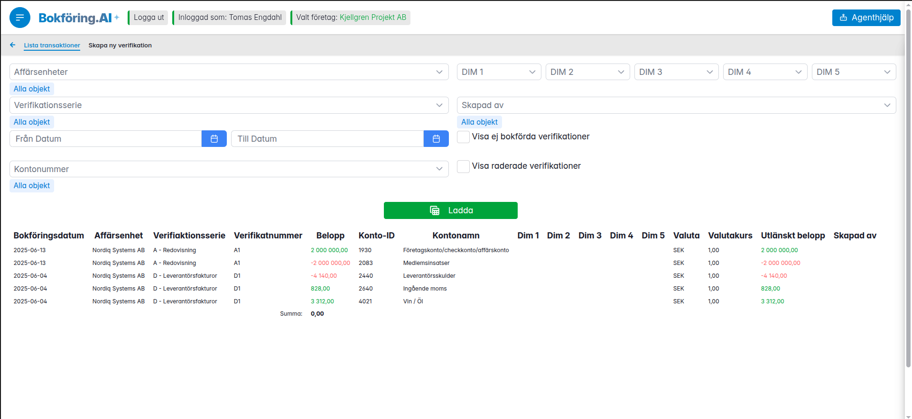
  </a>
  <a href="images/list_transaktions_with_detail.png" target="_blank">
    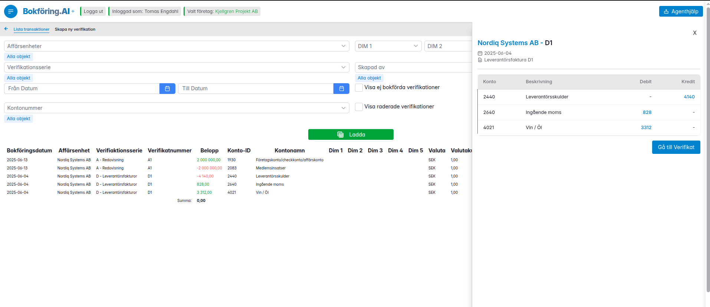
  </a>

<h4>Fakturering</h4>

  <a href="images/invoice_products.png" target="_blank">
    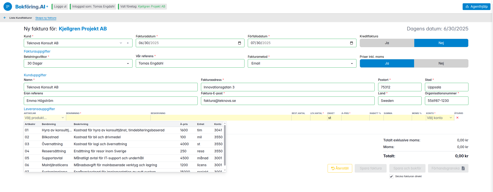
  </a>
  <a href="images/invioce_ready.png" target="_blank">
    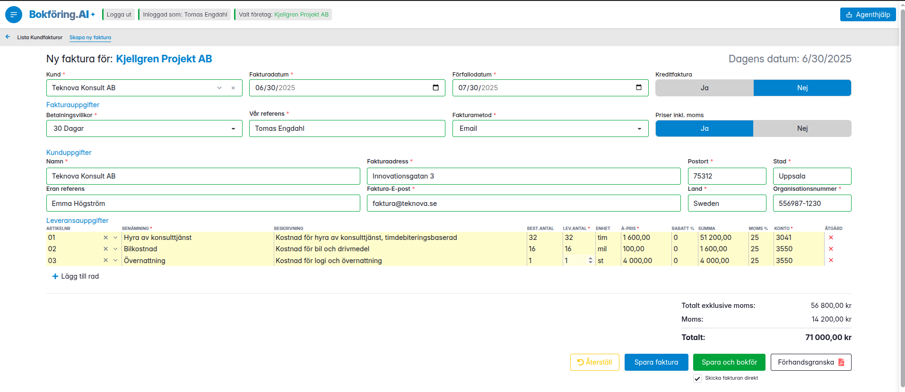
  </a>
  <a href="images/invoice_preview.png" target="_blank">
    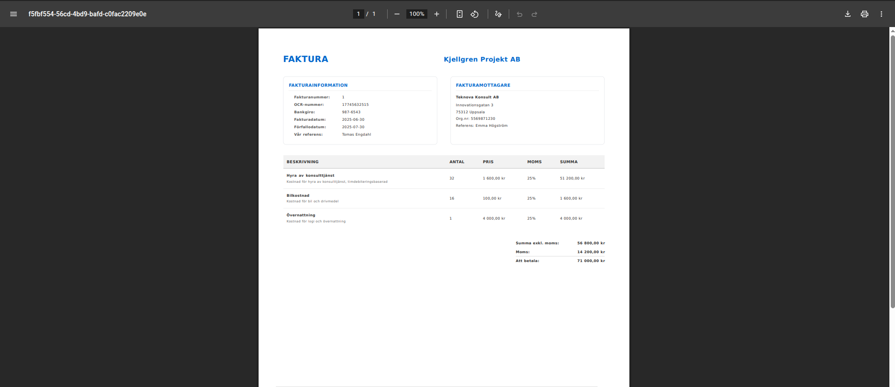
  </a>

<h4>Leverantörsfakturor</h4>

  <a href="images/supplier_invoices_home.png" target="_blank">
    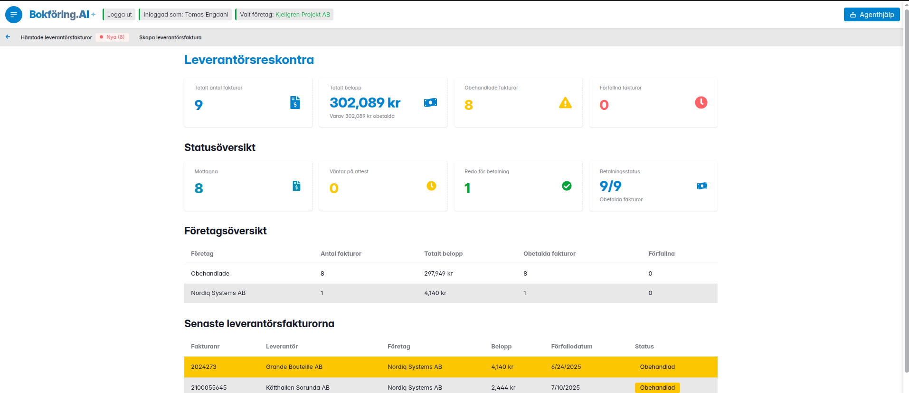
  </a>
  <a href="images/supplier_invoices_create_supplier.png" target="_blank">
    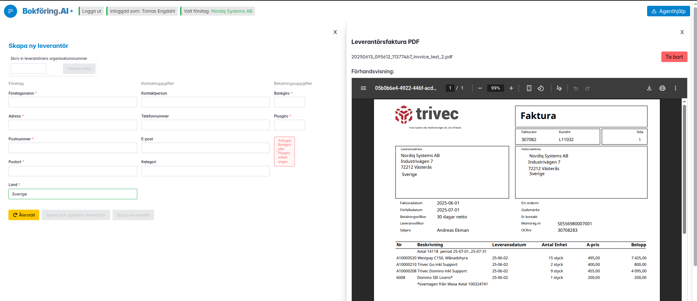
  </a>
    
  

<h4>Register</h4>

  <a href="images/chart_of_accounts.png" target="_blank">
    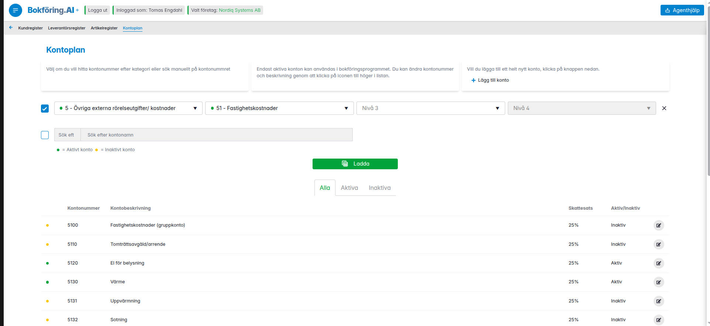
  </a>
  <a href="images/add_product.png" target="_blank">
    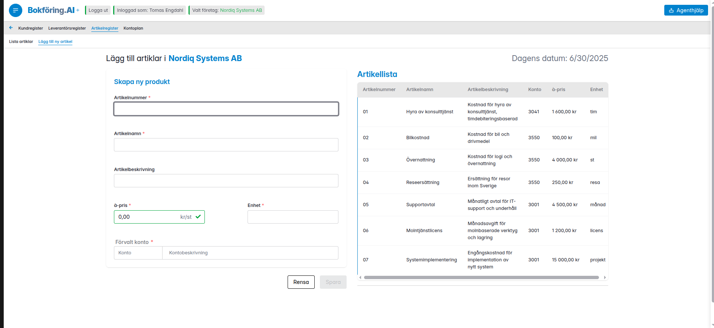
  </a>

<h4>Ai</h4>
<h6>Leverantörsfaktura, OCR tolkad av LLM utan RAG</h6>

  </a>
    <a href="images/supplier_invoice_low_score_rag.png" target="_blank">
    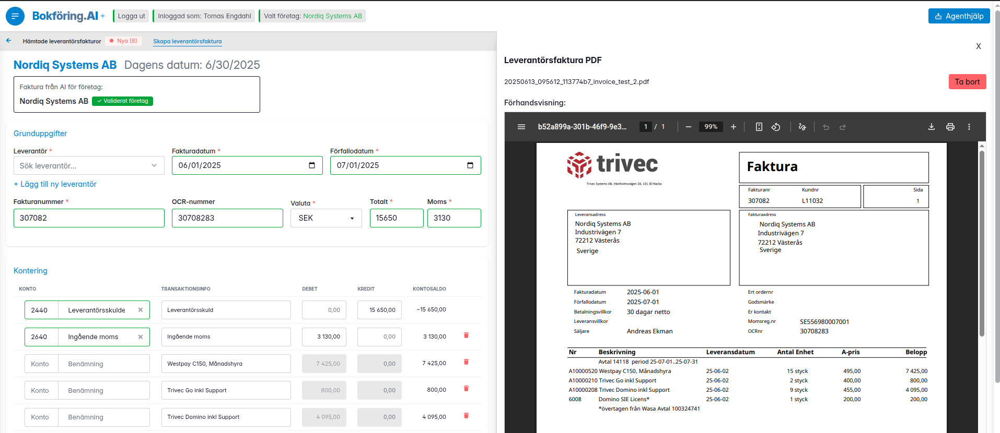
  </a>
  

<h6>Leverantörsfaktura, OCR tolkad av LLM med RAG</h6>
  

      <a href="images/supplier_invoice_high_score_rag.png" target="_blank">
    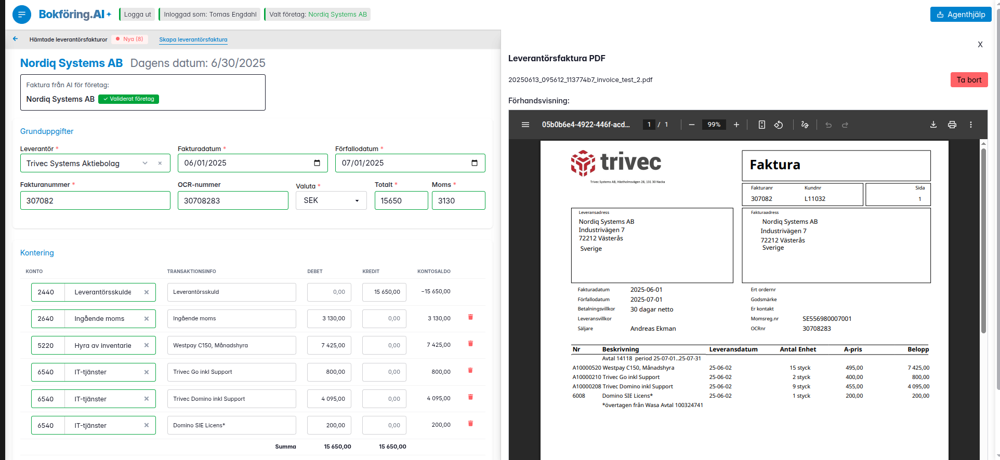
  </a>

<h6>Ai Assistent</h6>
  

      <a href="images/agent_with_tool_calling_through_mcp_sever.png" target="_blank">
    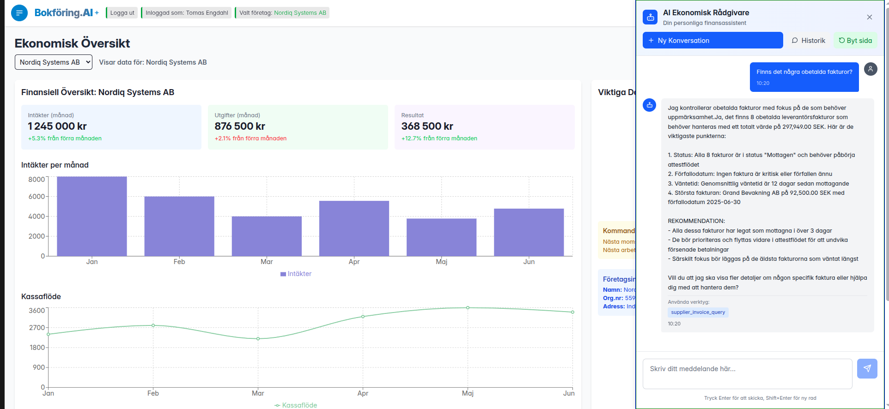
  </a>
    <a href="images/agent_question_1.png" target="_blank">
    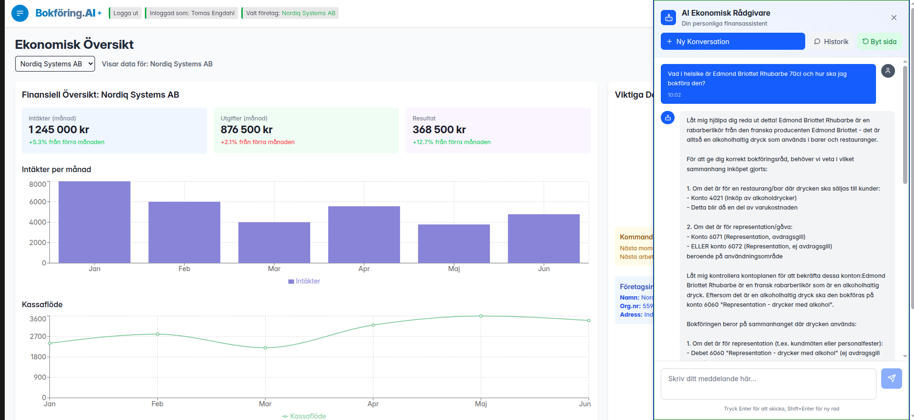
  </a>
      <a href="images/agent_history.png" target="_blank">
    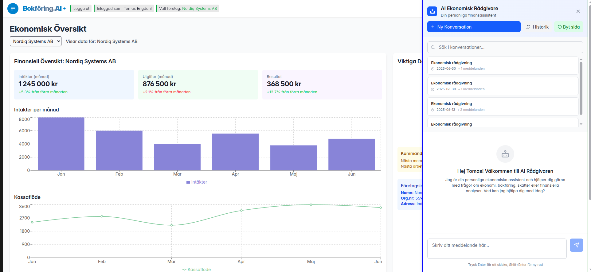
  </a>

<h6>Miro Databasstruktur</h6>

  

      <a href="images/postgreSQL_miro_structure.png" target="_blank">
    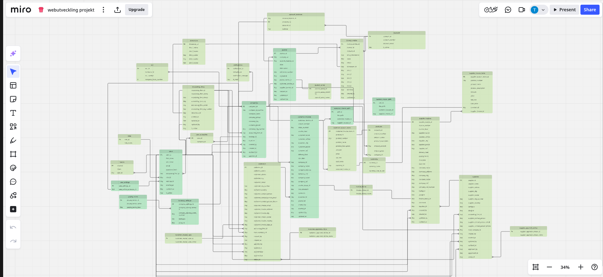
  </a>

<h6>Qdrant Vektordatabas</h6>

  

      <a href="images/qdrant_vector_db_accounts_overview.png" target="_blank">
    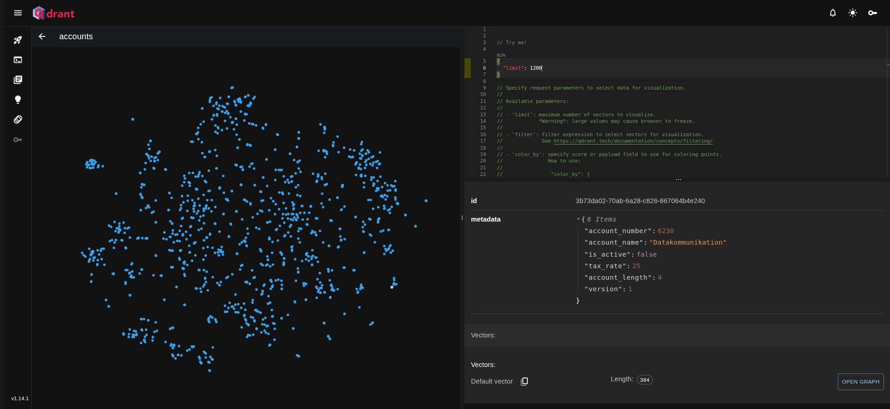
  </a>
        

